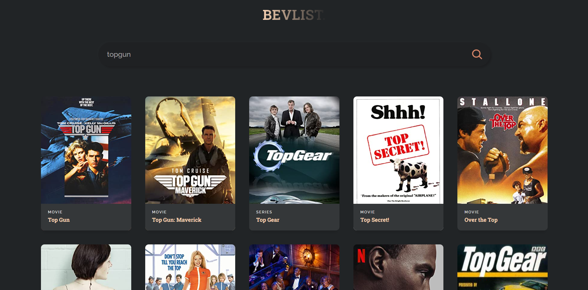

# BEVLIST MOVIES

A movies search engine, based on moives from imdB.


## Screenshots




## Acknowledgements

 - [OMDb API](https://www.omdbapi.com/)


## Demo

https://bevlist-movies.web.app/


## Tech Stack

React, CSS


## Environment Variables

To run this project, you will need to add the following environment variables to your .env file

`REACT_APP_I`

`REACT_APP_APIKEY`


## Run Locally

Clone the project

```bash
  git clone https://github.com/coffiejason/Bevlist-a-search-engine-for-movies.git
```

Go to the project directory

```bash
  cd project-directory
```

Install dependencies

```bash
  npm install
```

Start the server

```bash
  npm run start
```


## 🚀 About Me
I'm Coffie Jason, a full stack developer skilled in React and Nodejs. Reach out to me coffiejasoncj@gmail.com

